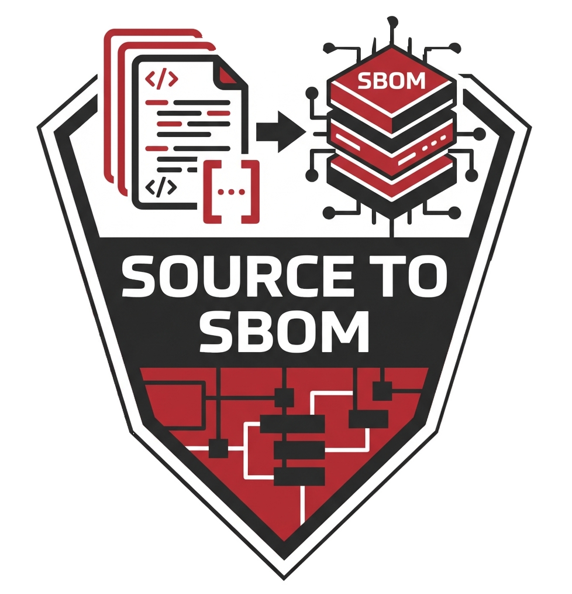

English | <a href="docs/i18n/README.zh-Hans.md">简体中文</a> | <a href="docs/i18n/README.zh-Hant.md">繁體中文</a> | <a href="docs/i18n/README.ja.md">日本語</a>

<p align="center">
  
</p>

# radeis_sc2sbom

**Fast SBOM generator.** Multi-ecosystem support with unique capabilities: ONLY tool with C/C++ Autotools, ROS 2, Git submodules, CMake ExternalProject, and AUTOSAR BSW support.

## Take Your SBOM Further with VicOne xZETA

The SBOMs generated by `radeis_sc2sbom` are fully compliant with **SPDX 2.3** and **CycloneDX 1.5** — ready to be imported directly into **[VicOne xZETA](https://vicone.com/products/xzeta)**, the industry-leading automotive vulnerability and SBOM management platform.

> **"Eliminate Blind Spots With 189% More Visibility"** — xZETA surpasses the National Vulnerability Database by 189%, covering zero-day, undisclosed, and known vulnerabilities alongside CWE, APTs, and ransomware.

**[Learn more about VicOne xZETA →](https://vicone.com/products/xzeta)**

---

## Why radeis_sc2sbom?

- **Most Comprehensive** — Detects 2.1%–58.8% more packages than competitors depending on project type
- **4+ Unique Capabilities** — ONLY tool with Autotools, ROS 2, Git submodules, CMake ExternalProject, and AUTOSAR BSW support
- **AI Model Support** — GGUF and Safetensors parsing with CycloneDX `machine-learning-model` and `pkg:huggingface` PURL
- **Standards-Compliant** — SPDX 2.3 (JSON + Tag-Value) and CycloneDX 1.5

## Quick Start

```bash
# Build
git clone <repository-url>
cd radeis_sc2sbom
cargo build --release

# Scan and generate all formats
./target/release/radeis_sc2sbom --path . --output ./out

# Single format to file
./target/release/radeis_sc2sbom --path . --format spdx-json --output ./out

# Single format to stdout
./target/release/radeis_sc2sbom --path . --format cyclonedx-json
```

## Supported Ecosystems

| Category | Ecosystem | Key Files |
|----------|-----------|-----------|
| **AI/ML Models** | Safetensors | `*.safetensors`, `config.json`, `generation_config.json`, `tokenizer_config.json` |
| **AI Models** | GGUF | `*.gguf`, `config.json`, `README.md` |
| **AUTOSAR** | BSW modules + SWC components | `*.arxml`, `*.epd`, BSW dir, CMake/Makefile tokens; versions from REVISION-LABEL + Doxygen headers — **ONLY TOOL** |
| **Robotics** | ROS/ROS2 | `package.xml`, `setup.py` — **ONLY SBOM TOOL** |
| **C/C++** | Autotools | `configure.ac`, `Makefile.am` — **ONLY TOOL** |
| **C/C++** | CMake | `CMakeLists.txt`, `*.cmake` — **ONLY TOOL** for ExternalProject |
| **C/C++** | Conan / vcpkg / pkg-config | Lock files, `.pc`, `conanfile.*` |
| **C/C++** | Meson / Bazel | `meson.build`, `WORKSPACE`, `MODULE.bazel` |
| **C/C++** | Makefile / .mk files | Heuristic parsing with variable resolution |
| **Version Control** | Git Submodules | `.gitmodules` with commit SHA — **ONLY TOOL** |
| **Python** | pip / Poetry / Pipenv | `requirements.txt`, `poetry.lock`, `pyproject.toml` |
| **JavaScript** | npm | `package.json`, `package-lock.json`, `yarn.lock` |
| **Rust** | Cargo | `Cargo.toml`, `Cargo.lock` |
| **Java** | Gradle / Maven | `build.gradle`, `build.gradle.kts`, `pom.xml` |
| **Go / Ruby / PHP** | Standard | `go.mod`, `Gemfile`, `composer.json` |

All ecosystems include license extraction, supplier metadata, and CPE identifiers.

## Common Commands

```bash
# Full scan with all formats
./target/release/radeis_sc2sbom --path . --output ./out

# Production SBOM (runtime + optional dependencies only)
./target/release/radeis_sc2sbom --path . \
  --production \
  --format spdx-json

# AUTOSAR project with supplier mapping
./target/release/radeis_sc2sbom --path . \
  --supplier-config suppliers.yaml \
  --format cyclonedx-json --output ./out
```


## Key Options

```
--path <PATH>                  Directory to scan (required)
--format <FORMAT>              console | spdx-json | spdx-tag-value | cyclonedx-json | all (default: all)
--output <DIR>                 Output directory; omit for stdout (single formats)
--production                   Include runtime + optional dependencies only
--scope-filter <SCOPE>         runtime | build | test | dev | optional | provided
--supplier-config <PATH>       YAML mapping AUTOSAR component names to supplier strings
--bsw-config <PATH>            Override bundled AUTOSAR BSW module config
--ros-distro <DISTRO>          jazzy | iron | humble (default: jazzy)
--target-arch <ARCH>           Target architecture for .mk conditional resolution
--scan-submodules              Git submodule scanning (default: true)
--scan-c-build-systems         CMake, pkg-config, Autotools, Makefiles, .mk (default: true)
--scan-ai-models               GGUF + Safetensors AI model scanning (default: true)
--compact-spdx                 ~30% smaller SPDX output
```


See [docs/CLI.md](docs/CLI.md) for the complete reference.

## What's New


### v1.0.16 — C/C++ Lexical CWE Scanner (Internal)

- **Lexical SAST scanner** — Scans C/C++ source for 14 dangerous-function CWEs at call sites: CWE-20, 22, 78, 120, 126, 134, 190, 242, 327, 362, 367, 377, 676, 807
- **Standalone C project support** — Projects with no package manifests (e.g. NIST Juliet test suite) are automatically detected and scanned via fallback mode
- **Dedicated static analysis report** — `<project>_static_analysis.md` lists findings by component, CWE ID, and call site (file + line)
- **CycloneDX SAST integration** — Findings appear in the `vulnerabilities[]` array with `source.type = "other"` and `source.name = "SAST"`, compliant with CycloneDX 1.5
- **Internal feature gate** — Scanner is compiled in only when built with `--features internal`; public builds are unaffected
<!-- END_INTERNAL -->

### v1.0.15 — AUTOSAR Support & CVE/CWE Enrichment

- **AUTOSAR detection** — Auto-detects AUTOSAR projects via `.arxml` files, BSW/MCAL/RTE directory names, or `AUTOSAR_VERSION` tokens in build files
- **AUTOSAR classification** — BSW components tagged with `autosar:layer`, `autosar:platform` in CycloneDX properties and SPDX ExternalRefs
- **Supplier mapping** — `--supplier-config <yaml>` maps component names to supplier strings; emits `autosar:supplier` (falls back to `NOASSERTION`)
- **`--output` for single formats** — `--format spdx-json --output ./out` now writes to a file; omitting `--output` prints to stdout

### v1.0.14 — Reliability & SBOM Quality

- Broken symlink tolerance — scanner no longer aborts on broken symlinks
- Makefile `$(VAR)` filtering — variable references no longer leak into `versionInfo`
- C/C++ license resolution — `.pc` `License:` field + 24-entry known-library table
- Static Linux binary (musl) — runs on Ubuntu 22.04+, Alpine, and any x86_64 Linux without glibc dependency

### Earlier Releases

See [CHANGELOG.md](CHANGELOG.md) and [docs/WHATS_NEW.md](docs/WHATS_NEW.md) for full history.

## Benchmarks Summary

| Repository | radeis Packages | Competitor Best | Advantage |
|------------|-----------------|-----------------|-----------|
| curl (C) | 44 | 41 (Syft) | +3 — ONLY Autotools support |
| nodejs-project | 689 | 670 (OSV) | +19 — deepest transitive (79%) |
| mrpt (Robotics C++) | 54 | 34 (OSV) | +20 (58.8%) — ONLY Git submodules + CMake |
| ros2cli (ROS 2) | 223 | ~158 (OSV) | +65 (29.2%) — ONLY ROS 2 support |

See [docs/BENCHMARKS.md](docs/BENCHMARKS.md) for full comparisons.

## Output Files

Default location: `./out/`

```
<project>_report.md             # Console report (markdown)
<project>_spdx.json             # SPDX 2.3 JSON
<project>_spdx.spdx             # SPDX 2.3 Tag-Value
<project>_cyclonedx.json        # CycloneDX 1.5 JSON
```

## Documentation

- [CLI Reference](docs/CLI.md)
- [Usage Guide](docs/USAGE.md)
- [What's New](docs/WHATS_NEW.md)
- [Scope Classification](docs/SCOPE_CLASSIFICATION.md)
- [Architecture](docs/ARCHITECTURE.md)
- [Benchmarks](docs/BENCHMARKS.md)

## Requirements

- Rust 1.70+

## License

MIT — see [LICENSE](LICENSE)

## Authors

Amean Lin · William Chang

## Support

- **Bug reports & feature requests** — [Open an issue](../../issues)
- **Enterprise & product inquiries** — [Contact VicOne](https://vicone.com/lab_r7/contact-us/)

---

<p align="center">
  Made with ❤️ for supply chain security
</p>
